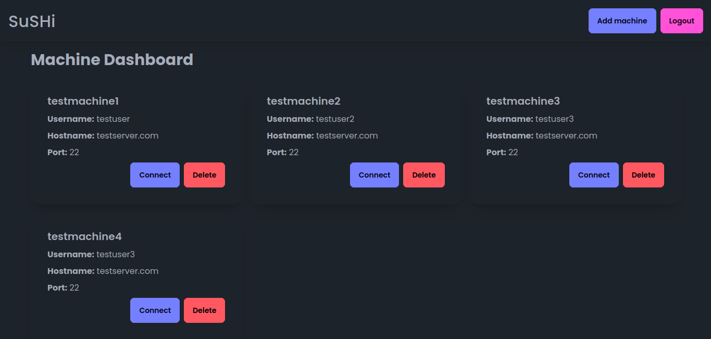

## SuSHI (Work in Progress)

SuSHI is a web-based platform that helps to make SSH connections to remote machines from any location, with a browser based terminal. 

### Features
- Secure SSH Connections: Connect to remote machines securely using SSH.
- Web-Based Terminal: Access the terminal interface directly in your web browser.
- Real-Time Communication: Utilize WebSockets for real-time communication between the client and server.
- User-Friendly Interface: Simple and intuitive interface for ease of use.
- Encrypted Private Keys: Private keys are stored in database securely using AES-CFB encryption with a key derived from PBKDF2-HMAC-SHA256 (10000 iterations), utilizing a unique salt and IV for each encryption operation.

### Screenshot

